<!--
  ┌─────────────────────────────────────────────────────────────┐
  │  BEFORE YOU PUSH — replace 3 things:                          │
  │   1. YOUR_USERNAME   → your GitHub username (appears 2×)       │
  │   2. YOUR_LINKEDIN   → full LinkedIn profile URL              │
  │   3. YOUR_EMAIL      → your email address                     │
  │  Then commit banner.svg + README.md to a repo named exactly   │
  │  YOUR_USERNAME/YOUR_USERNAME (a repo matching your username). │
  └─────────────────────────────────────────────────────────────┘
-->

  

  <b>I ship the product — then I make people find it.</b>

I'm a software engineer with an unusual second discipline: performance marketing. I build applications end to end with **TypeScript, React, and Node.js**, and I own the growth side too — analytics, technical SEO, and paid acquisition across Google and Meta. Holding both means the things I build are measurable and findable on day one, not bolted on later.

Currently building at **TechParadice** and **DragLab**, and open to software engineering roles across Europe.

**⌁ Build**  

**⌁ Grow**  

<h3 align="center">Snapshot</h3>

  
  

<h3 align="center">Say hello</h3>

  <b>مرحبا&nbsp; ·&nbsp; Merhaba&nbsp; ·&nbsp; Hello&nbsp; ·&nbsp; Hallo</b> 
  I work across four languages.

  
  
  

